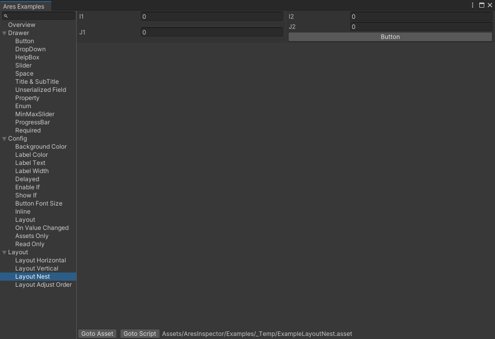
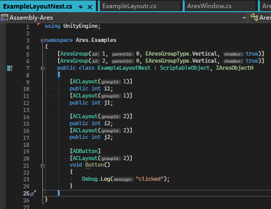

# AresInspector

AresInspector 是 类似odin的Unity编辑器脚本，使用Attribute的方式来制作编辑器。
和odin不同的是，AresInspector更加轻量，使用了纯UIToolkit(VisualEment),没有使用IMGUI。

包含Layout,Drawer,Config三大类。

## 例子
用unity打开工程，选择Ares/Examples菜单，打开的窗口里有所有的例子。
窗口底部有Goto Script按钮，可以看到对应的代码。

## 支持与联系
使用过程中有任何问题可以联系作者： QQ 94285060
